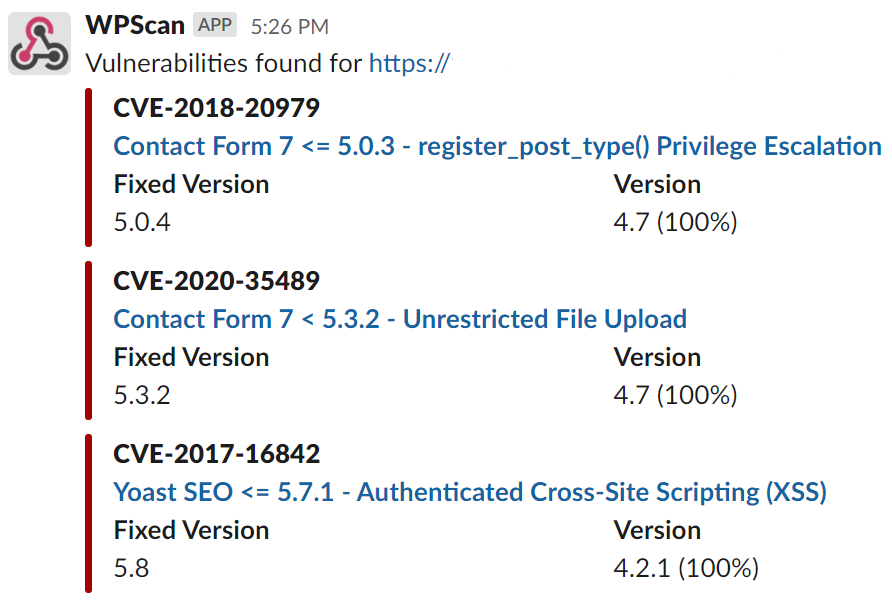

# WPScan docker action

Scan a URL with `wpscan`, a [WordPress vulnerability scanner](https://wpscan.com/).


## Examples

#### Run a scan
```yaml
uses: WTFender/wpscan-action@v1.0
with:
  url: 'https://WORDPRESS_SITE/'
```

#### Weekly scan, notify webhook, and echo results
```yaml
on:
  schedule:
    - cron:  0 10 * * 1 # Monday at 10 UTC
jobs:
  wpscan:
    runs-on: ubuntu-latest
    steps:
      - name: WPScan
        uses: WTFender/wpscan-action@v1.0
        id: wpscan
        with:
          url: 'https://WORDPRESS_SITE/'
          token: ${{ secrets.WPSCAN_TOKEN }}
          webhook: ${{ secrets.SLACK_WEBHOOK }}
      - name: Scan Results
        run: |
          echo ${{ steps.wpscan.outputs.resultb64 }}
          echo ${{ steps.wpscan.outputs.result }}
```

## Inputs

### `url`

**Required**. Scan target URL.

### `token`

API token for wpscan.com. Required for vulnerability data.

### `options`

WPScan CLI options.  Default `--disable-tls-checks`.

### `webhook`

Slack webhook URL.

### `webhookevent`

Events to send webhook on: Default `vulns,aborted`. Allowed `vulns,aborted,completed`.

## Outputs

### `result`

JSON scan results.

### `resultb64`

JSON scan results, base64 encoded.


## Webhook

